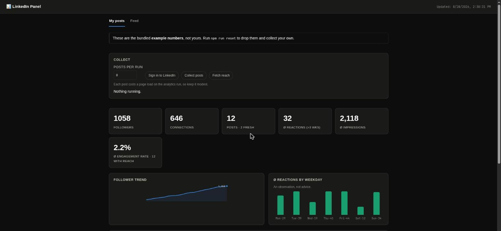
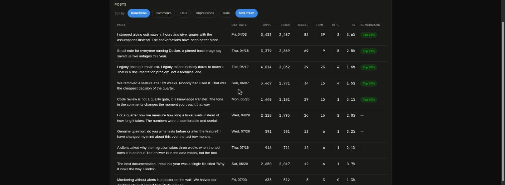

# LinkedIn Panel

[](https://codecov.io/gh/Mario-Mohar/linkedin-panel)

Collects your own LinkedIn posts, their metrics and your follower count as a time
series, and shows them in a local dashboard. Read-only: it never posts, likes or
comments.

**[English](#english) · [Deutsch](#deutsch)**

<p align="center">
  
</p>

<p align="center">
  
</p>

<p align="center"><sub>Screenshots taken with the bundled example data, which is invented. · Screenshots mit den mitgelieferten Beispieldaten, die Zahlen sind erfunden.</sub></p>

---

# English

## What it does

LinkedIn shows you numbers, but no history. This tool keeps one: it reads your own
posts and their reach on a schedule, appends everything as versioned NDJSON files
under `data/`, and serves a local panel on top of it.

There are two collectors, and the difference between them matters:

| | Source | Speed | Gives you |
|---|---|---|---|
| `npm run collect` | cards on your activity page | fast | reactions, comments, reposts |
| `npm run analytics` | the post analytics page | slow, one page per post | impressions, reach, saves, sends, profile views and followers gained per post |

Both write into the same store. `collect` runs often and keeps the reaction counts
current, `analytics` runs rarely and adds the reach on top.

## Setup

```bash
npm install
npm run setup
```

`setup` walks through the rest: it checks your Node version, offers to download
the browser, clears the bundled example data, opens the login window and runs the
first collection. It asks before every step and does nothing irreversible without
a yes.

By hand instead, if you prefer:

```bash
npx playwright install chromium   # only if no Brave/Chromium is installed
npm run reset                     # drop the bundled example data
npm run login                     # sign in to LinkedIn in the window that opens
npm run collect
```

## Usage

```bash
npm run collect    # a single collection run now (feed cards, fast)
npm run analytics  # post analytics: impressions and reach (slower)
npm run start      # scheduler: several times a day, adaptive (golden hour)
npm run status     # health: recent runs, number of posts
npm run dashboard  # local panel at http://localhost:4599
```

To try it without an account, see [Example data](#example-data).

Data lives as NDJSON under `data/posts|metrics|profile|runs/`, the browser session in
`browser-profile/`.

## Language

Two different languages are involved, and they are configured separately.

| | Setting | Meaning |
|---|---|---|
| Tool language | `LIP_LANG` | dashboard and console output (`de`, `en`) |
| LinkedIn language | `LIP_LI_LANG` | the language *your LinkedIn* is set to, which decides how the pages are read |

`LIP_LANG` defaults to your system locale and falls back to English.
`LIP_LI_LANG` defaults to `auto` and is read off the open page, so normally you do
not set it at all. Getting it wrong does not raise an error, it quietly produces
empty numbers — which is exactly why it is detected rather than configured. Every
run prints which language it settled on.

You can run LinkedIn in German and the panel in English:

```bash
LIP_LANG=en LIP_LI_LANG=de npm run dashboard
```

## Browser

Uses an installed **Brave** binary (Chromium based) when it finds one, otherwise the
bundled Playwright Chromium. Override with `LIP_BROWSER_PATH=/path/to/browser`. The
profile is dedicated and independent of your everyday Brave — run `npm run login`
once, after that `collect` and `analytics` run headless with that session.

## Dashboard

```bash
npm run dashboard   # http://localhost:4599
```

At the top sits a **Collect** panel: pick how many posts a run should take, then
start the sign-in, a post collection or a reach collection straight from the page.
While something runs the buttons are disabled, the output appears live, and the
numbers reload by themselves when it finishes. The chosen count is remembered in
your browser.

Because that means a web page can start a browser automation, the endpoint only
accepts requests from the panel itself (same origin plus a header a cross-origin
form post cannot set), only ever starts one of three fixed commands, and never
runs two at once. Everything the buttons do is also available as a terminal
command — the panel is a convenience, not the only way in.

Below that it shows KPIs (followers, connections, posts, Ø reactions, Ø impressions,
Ø engagement rate), a sortable and filterable post table with an age-fair benchmark (percentile
among posts of comparable age), the follower trend and an observation by weekday
(deliberately labelled as an observation, not advice). Clicking a post opens its full
text and metric history. Fresh posts (younger than `LIP_FRESH_DAYS`, 21 days by
default) are marked and excluded from benchmark comparisons, because they have not
matured yet.

## Reach and the real engagement rate

The feed collector reads the cards on your activity page. There are no impressions
there. Those only exist on the post analytics page, which is what `analytics` reads.

That is the difference between two very different numbers:

| | Formula | When |
|---|---|---|
| **Engagement rate** | social interactions ÷ impressions | once `analytics` has run |
| **Follower quota** | (reactions+comments+reposts) ÷ follower count | the stand-in without impressions |

The follower quota is not an engagement rate, and the dashboard does not label it as
one. It only appears while no reach data is available, and older posts come out too
low under it, because today's follower count sits in the denominator.

### Interface labels

The analytics page has no stable selectors — the numbers are only reachable through
their **labels**, which ties reading them to the language your LinkedIn is set to.

- **German** is built in and verified against the real interface.
- **English** is built in but **not verified** — the labels are modelled on the German
  ones and may differ.
- The same label sets also carry the terms the feed collector needs (the aria-labels
  for comments and reposts, the words for followers and connections), because those
  are translated too.
- Any other language (or a changed label) through your own JSON file.

```bash
LIP_LI_LANG=en npm run analytics
npm run analytics -- --dump-page page.txt   # inspect the page text, visible window
LIP_LI_LABELS=./my-labels.json npm run analytics
```

`--dump-page` writes the text of the analytics page to a file and reports which fields
the current labels recognised and which they did not. That is enough to assemble your
own label file in a few minutes without digging through the code.

## Feed assistant

```bash
npm run feed        # one feed run: scrape → rank → drafts
```

Requires `npm run login` to have run (a signed-in session in `browser-profile/`) and
the local `claude` CLI to be installed and signed in (subscription, no API key needed —
`claude -p "test" --output-format text` should answer). The run opens the home feed
headless, reads up to 25 posts (text, author and counters only; no click, no like, no
comment), filters out ads, your own posts and anything older than `LIP_FEED_MAX_AGE_H`,
ranks the rest, and has `claude -p` write two comment drafts each for the top
`LIP_FEED_TOPN` posts, in the language of the post. The result lands in
`data/feed/latest.json` and appears in the dashboard under the **Feed** tab.

**Read-only:** the assistant never posts, likes or comments — it only supplies a rank
and a draft. Whether and what you comment is yours to decide and to type (copy the
draft; "↗ open" in the dashboard takes you to the post).

**Privacy:** `data/feed/` is in `.gitignore` on purpose — unlike your own post history,
other people's feed content is not a dataset that belongs in a git repository, private
or not. Every run overwrites `data/feed/latest.json`; no history of other people's feed
content is kept.

**What the score means (0–100, four weighted parts):**
- **Timing** (30%): freshness (sweet spot ~0–6 h, declining after) blended with momentum
  (reactions+comments per hour since publication).
- **Reach** (25%): interactions (reactions+comments+reposts) relative to the strongest
  post in the current run — an engagement proxy, **not** a follower or impression count
  (LinkedIn does not expose those for other people's posts).
- **Topical** (30%): closeness to your own recent posts — scored by AI (0–10), with a
  fallback to simple word matching when `claude` is unavailable.
- **Relationship** (15%): the author's connection degree (1st/2nd/3rd).

**Honest limits:** the score is a **single snapshot** taken at scrape time, not a time
series — "momentum" is estimated from one measurement (counter ÷ age), not from repeated
ones like the post tracking. "Reach" measures visible interaction, not actual reach.
LinkedIn's home feed is hardened against scraping (obfuscated CSS classes, no
`data-urn`). The collector therefore reads the **semantic anchors** LinkedIn keeps
stable for screen readers and its own tests — aria-labels ("Beitrag von X ausblenden",
"… Profil 2.") and `data-testid="expandable-text-box"` for the text — instead of CSS
classes. **Limit:** LinkedIn no longer exposes the activity URN in the feed, so
"↗ open" points at the **author profile** rather than the exact post, and `postedAt` is
only accurate to the day (from the relative text). Note: LinkedIn throttles automated
access from time to time with an error code (HTTP 999 /
`ERR_HTTP_RESPONSE_CODE_FAILURE`) — wait a few hours then, ideally overnight, rather
than retrying.

## Configuration (selection)

| Variable | Default | Purpose |
|---|---|---|
| `LIP_LANG` | system locale, else `en` | language of the tool (`de`, `en`) |
| `LIP_POST_LIMIT` | `35` | posts per feed run |
| `LIP_ANALYTICS_LIMIT` | `15` | posts per analytics run (each costs a page load) |
| `LIP_LI_LANG` | `auto` | language of the LinkedIn interface (`auto`, `de`, `en`) |
| `LIP_LI_LABELS` | – | path to your own labels (JSON) |
| `LIP_FRESH_DAYS` | `21` | when a post counts as matured |
| `LIP_DASHBOARD_PORT` | `4599` | port of the panel |
| `LIP_DATA_DIR` | `./data` | data directory |
| `LIP_MACHINE_ID` | hostname | name of this machine's shard file |
| `LIP_BROWSER_PATH` | Brave, else Chromium | browser binary |
| `LIP_FEED_TOPN` | `5` | top posts that get AI drafts |
| `LIP_FEED_MAX_AGE_H` | `24` | feed posts older than this are ignored |

Complete list in `src/config.ts`.

## Example data

So the dashboard shows something without a LinkedIn account attached, made-up example
data can be generated:

```bash
node scripts/make-example-data.mjs   # writes data/*/example.ndjson + a marker
npm run dashboard
```

While the marker `data/.example-data` is present, the panel says clearly at the top
that these are not your numbers. **The first real collection deletes them by itself**,
so nobody ends up with their own figures averaged together with invented ones. You can
also clear them up front:

```bash
npm run reset                    # deletes example data (asks first)
npm run reset -- --yes           # no question asked, example data only
npm run reset -- --yes --force   # also deletes collected data
```

`reset` does not touch `browser-profile/`, so a reset does not mean logging in again.
`--yes` alone refuses to delete collected data: a real history is months of
measurements that LinkedIn will not hand out a second time. The numbers are generated
deterministically and the script is included, so it stays traceable where they came
from.

## Data and multiple machines

The **collected history lives in the versioned NDJSON files under `data/`, not at
LinkedIn** — LinkedIn shows no history itself, so this local store is the only source
for time series (follower trend, metric history per post).

Every machine writes **only its own shard file** per category:
`data/posts/<machine>.ndjson`, `data/metrics/<machine>.ndjson`,
`data/profile/<machine>.ndjson` (machine name = `LIP_MACHINE_ID`, else the hostname).
Because each machine only ever appends to its own file and never touches another one,
merges between machines are **conflict free** — `git pull`/`rebase` can never land two
machines in the same line.

On startup the store reads **all** shard files of a category and merges them into one
dataset. As soon as a second machine receives the first machine's shards through
`git pull`, its dashboard sees the **full history of all machines**, not just its own.
That is what keeps long-term statistics (follower trend, age benchmarks) correct even
when you collect from several machines in turn.

```bash
npm run sync        # git pull --rebase → collect → commit (if changed) → push
npm run migrate     # once: old data/panel.db → NDJSON (if present)
```

`npm run sync` pulls the other machines' shards **first** (`git pull --rebase`) before
collecting and committing. That pull-before-collect is why the machines stay
consistent.

To just look at the data on another machine without collecting:

```bash
git pull
npm run dashboard
```

`browser-profile/` (session cookies) and `data/runs/` (a pure run log) stay **out** of
git on purpose — they are machine-local or diagnostic noise with no value elsewhere.

**Careful when you fork this publicly.** `data/` is versioned on purpose, which is what
makes the history work across your machines — but it means a `git push` to a public fork
publishes your post texts and your reach figures. Keep your fork private, or add
`data/` to `.gitignore` and give up the cross-machine history.

## Continuous operation (optional, systemd user service)

`~/.config/systemd/user/linkedin-panel.service`:

```ini
[Unit]
Description=LinkedIn Panel Collector
[Service]
WorkingDirectory=%h/path/to/linkedin-panel
ExecStart=/usr/bin/npm run start
Restart=on-failure
[Install]
WantedBy=default.target
```

```bash
systemctl --user enable --now linkedin-panel
```

## Licence

MIT, see [LICENSE](LICENSE).

## Notes

- Read-only: the tool never posts, likes or comments.
- On "not logged in": run `npm run login` again.
- Automated access to LinkedIn is against their terms of use, including access to your
  own data. Decide for yourself whether that matters to you.

---

# Deutsch

## Was es macht

LinkedIn zeigt dir Zahlen, aber keinen Verlauf. Dieses Werkzeug führt einen: es liest
regelmäßig deine eigenen Beiträge und deren Reichweite, schreibt alles als versionierte
NDJSON-Dateien unter `data/` fort und zeigt darauf ein lokales Panel.

Es gibt zwei Sammler, und der Unterschied zwischen ihnen ist wichtig:

| | Quelle | Tempo | Liefert |
|---|---|---|---|
| `npm run collect` | Kacheln der Aktivitätsseite | schnell | Reaktionen, Kommentare, Reposts |
| `npm run analytics` | Beitragsanalyse-Seite | langsam, eine Seite pro Beitrag | Impressions, Reichweite, Speicherungen, Sends, Profilansichten und gewonnene Follower je Beitrag |

Beide schreiben in denselben Store. `collect` läuft oft und hält die Reaktionen aktuell,
`analytics` läuft selten und legt die Reichweite dazu.

## Einrichtung

```bash
npm install
npm run setup
```

`setup` führt durch den Rest: es prüft die Node-Version, bietet den Browser-Download
an, räumt die mitgelieferten Beispieldaten weg, öffnet das Login-Fenster und macht den
ersten Sammel-Lauf. Vor jedem Schritt wird gefragt, ohne ein Ja passiert nichts
Unumkehrbares.

Lieber von Hand:

```bash
npx playwright install chromium   # nur wenn kein Brave/Chromium installiert ist
npm run reset                     # mitgelieferte Beispieldaten wegwerfen
npm run login                     # im Fenster bei LinkedIn einloggen
npm run collect
```

## Nutzung

```bash
npm run collect    # ein einzelner Sammel-Lauf jetzt (Feed-Kacheln, schnell)
npm run analytics  # Beitragsanalysen: Impressions und Reichweite (langsamer)
npm run start      # Scheduler: mehrmals täglich, adaptiv (Golden-Hour)
npm run status     # Gesundheit: letzte Läufe, Anzahl Beiträge
npm run dashboard  # lokales Panel auf http://localhost:4599
```

Zum Ausprobieren ohne Konto siehe [Beispieldaten](#beispieldaten).

Die Daten liegen als NDJSON unter `data/posts|metrics|profile|runs/`, die
Browser-Session in `browser-profile/`.

## Sprache

Hier sind zwei verschiedene Sprachen im Spiel, und sie werden getrennt eingestellt.

| | Einstellung | Bedeutung |
|---|---|---|
| Sprache des Werkzeugs | `LIP_LANG` | Dashboard und Konsolenausgabe (`de`, `en`) |
| Sprache von LinkedIn | `LIP_LI_LANG` | die Sprache, auf die *dein LinkedIn* eingestellt ist; sie entscheidet, wie die Seiten gelesen werden |

`LIP_LANG` richtet sich standardmäßig nach deiner Systemsprache und fällt sonst auf
Englisch zurück. `LIP_LI_LANG` steht auf `auto` und wird von der offenen Seite
abgelesen, normalerweise stellst du es also gar nicht ein. Ein falscher Wert wirft
keinen Fehler, er liefert still leere Zahlen — genau deshalb wird er erkannt und nicht
konfiguriert. Jeder Lauf schreibt dazu, auf welche Sprache er sich festgelegt hat.

Du kannst LinkedIn auf Deutsch fahren und das Panel auf Englisch:

```bash
LIP_LANG=en LIP_LI_LANG=de npm run dashboard
```

## Browser

Nutzt eine installierte **Brave**-Binary (Chromium-basiert), wenn es eine findet, sonst
das gebündelte Playwright-Chromium. Überschreibbar mit `LIP_BROWSER_PATH=/pfad/zum/browser`.
Das Profil ist eigenständig und unabhängig von deinem täglichen Brave — einmal
`npm run login`, danach laufen `collect` und `analytics` headless mit dieser Session.

## Dashboard

```bash
npm run dashboard   # http://localhost:4599
```

Ganz oben sitzt ein **Sammeln**-Bereich: dort stellst du ein, wie viele Beiträge ein
Lauf nehmen soll, und startest die Anmeldung, eine Beitrags-Sammlung oder eine
Reichweiten-Sammlung direkt von der Seite aus. Während etwas läuft sind die Knöpfe
gesperrt, die Ausgabe erscheint mit, und die Zahlen laden sich am Ende von selbst neu.
Die eingestellte Anzahl merkt sich dein Browser.

Weil damit eine Webseite eine Browser-Automatisierung starten kann, nimmt der Endpunkt
nur Anfragen aus dem Panel selbst an (gleicher Origin plus ein Header, den ein
Formular-Post von fremder Seite nicht setzen kann), startet ausschließlich einen von
drei festen Befehlen und nie zwei gleichzeitig. Alles, was die Knöpfe tun, geht auch
weiterhin im Terminal — das Panel ist eine Bequemlichkeit, kein Zwang.

Darunter zeigt es KPIs (Follower, Kontakte, Beiträge, Ø Reaktionen, Ø Impressions, Ø
Engagement-Rate), eine sortier- und filterbare Beitragsübersicht mit altersfairem
Benchmark (Perzentil unter Beiträgen vergleichbaren Alters), den Follower-Trend und
eine Wochentag-Beobachtung (bewusst als Beobachtung beschriftet, kein Ratschlag). Klick
auf einen Beitrag öffnet Volltext und Metrik-Verlauf. Frische Beiträge (jünger als
`LIP_FRESH_DAYS`, Standard 21 Tage) sind markiert und aus Benchmark-Vergleichen
ausgenommen, weil sie noch nicht ausgereift sind.

## Reichweite und die echte Engagement-Rate

Der Feed-Sammler liest die Kacheln der Aktivitätsseite. Dort stehen keine Impressions.
Die gibt es nur auf der Beitragsanalyse-Seite, und genau die liest `analytics`.

Das ist der Unterschied zwischen zwei sehr verschiedenen Zahlen:

| | Formel | Wann |
|---|---|---|
| **Engagement-Rate** | soziale Interaktionen ÷ Impressions | sobald `analytics` gelaufen ist |
| **Follower-Quote** | (Reaktionen+Kommentare+Reposts) ÷ Follower-Stand | Notbehelf ohne Impressions |

Die Follower-Quote ist keine Engagement-Rate, und das Dashboard beschriftet sie auch
nicht so. Sie erscheint nur, solange keine Reichweitendaten vorliegen, und ältere
Beiträge fallen bei ihr zu niedrig aus, weil der heutige Follower-Stand im Nenner steht.

### Beschriftungen der Oberfläche

Die Analyseseite hat keine stabilen Selektoren — die Zahlen sind nur über ihre
**Beschriftung** greifbar. Damit hängt das Auslesen an der Sprache, auf die dein
LinkedIn eingestellt ist.

- **Deutsch** ist eingebaut und gegen die echte Oberfläche geprüft.
- **Englisch** ist eingebaut, aber **nicht verifiziert** — die Beschriftungen sind nach
  der deutschen Vorlage angesetzt und können abweichen.
- Dieselben Label-Sätze enthalten auch die Begriffe, die der Feed-Sammler braucht (die
  aria-Labels für Kommentare und Reposts, die Wörter für Follower und Kontakte), denn
  die sind ebenfalls übersetzt.
- Jede andere Sprache (oder eine geänderte Beschriftung) über eine eigene JSON-Datei.

```bash
LIP_LI_LANG=en npm run analytics
npm run analytics -- --dump-page seite.txt   # Seitentext ansehen, sichtbares Fenster
LIP_LI_LABELS=./meine-labels.json npm run analytics
```

`--dump-page` schreibt den Text der Analyseseite in eine Datei und sagt dazu, welche
Felder mit den aktuellen Beschriftungen erkannt wurden und welche nicht. Damit lässt
sich eine eigene Label-Datei in wenigen Minuten zusammenstellen, ohne im Code zu suchen.

## Feed-Assistent

```bash
npm run feed        # ein einzelner Feed-Lauf: scrapen → ranken → Entwürfe
```

Voraussetzung: `npm run login` wurde bereits ausgeführt (eingeloggte Session in
`browser-profile/`), und die lokale `claude`-CLI ist installiert und eingeloggt
(Subscription, kein API-Key nötig — `claude -p "test" --output-format text` sollte
antworten). Der Lauf öffnet den Home-Feed headless, liest bis zu 25 Beiträge (nur Text,
Autor und Zähler, kein Klick, kein Like, kein Kommentar), filtert Werbeanzeigen, eigene
Beiträge und alles älter als `LIP_FEED_MAX_AGE_H` heraus, rankt den Rest und lässt für
die Top-`LIP_FEED_TOPN`-Beiträge per `claude -p` je zwei Kommentar-Entwürfe in der
Sprache des Beitrags formulieren. Das Ergebnis landet in `data/feed/latest.json` und
wird im Dashboard unter dem Tab **Feed** angezeigt.

**Read-only:** Der Assistent postet, liked oder kommentiert nie selbst — er liefert nur
Rang und Entwurf. Ob und was du kommentierst, entscheidest und tippst du selbst
(Entwurf kopieren, im Dashboard führt „↗ öffnen" zum Beitrag).

**Datenschutz:** `data/feed/` steht bewusst in der `.gitignore` — anders als die eigene
Post-Historie ist der Feed fremder Personen kein Datensatz, der in ein Git-Repo gehört,
auch nicht in ein privates. Jeder Lauf überschreibt `data/feed/latest.json`; es wird
kein Verlauf fremder Feed-Inhalte aufgehoben.

**Was der Score bedeutet (0–100, vier gewichtete Teile):**
- **Timing** (30 %): Mischung aus Frische (Süßpunkt etwa 0 bis 6 Stunden, danach
  abfallend) und Momentum (Reaktionen plus Kommentare pro Stunde seit Veröffentlichung).
- **Reach** (25 %): Interaktionen (Reaktionen, Kommentare, Reposts) relativ zum
  stärksten Beitrag im aktuellen Lauf — ein Engagement-Näherungswert, **keine**
  Follower- oder Impressions-Zahl (die legt LinkedIn bei fremden Beiträgen nicht offen).
- **Topical** (30 %): thematische Nähe zu deinen letzten eigenen Beiträgen, per KI
  bewertet (0 bis 10), mit Rückfall auf einfachen Wortabgleich, falls `claude` nicht
  verfügbar ist.
- **Relationship** (15 %): Verbindungsgrad des Autors (1., 2., 3. Grad).

**Ehrliche Grenzen:** Der Score ist eine **Momentaufnahme** zum Zeitpunkt des Auslesens,
keine Zeitreihe — „Momentum" ist aus einem einzigen Messpunkt geschätzt (Zählerstand
geteilt durch Alter), nicht aus wiederholten Messungen wie beim Post-Tracking. „Reach"
misst sichtbare Interaktion, nicht tatsächliche Reichweite. LinkedIns Home-Feed ist
gegen Auslesen gehärtet (obfuszierte CSS-Klassen, keine `data-urn`). Der Sammler liest
deshalb bewusst die **semantischen Anker**, die LinkedIn für Screenreader und eigene
Tests stabil hält, also aria-Labels („Beitrag von X ausblenden", „… Profil 2.") und
`data-testid="expandable-text-box"` für den Text, statt CSS-Klassen. **Grenze:** die
Aktivitäts-URN legt LinkedIn im Feed nicht mehr offen, daher zeigt „↗ öffnen" auf das
**Autor-Profil** statt auf den genauen Beitrag, und `postedAt` ist nur tagesgenau (aus
dem Relativtext). Hinweis: LinkedIn drosselt automatisierte Zugriffe zeitweise mit einem
Fehlercode (HTTP 999 / `ERR_HTTP_RESPONSE_CODE_FAILURE`) — dann einige Stunden warten,
am besten über Nacht, statt weiter zu probieren.

## Konfiguration (Auswahl)

| Variable | Standard | Zweck |
|---|---|---|
| `LIP_LANG` | Systemsprache, sonst `en` | Sprache des Werkzeugs (`de`, `en`) |
| `LIP_POST_LIMIT` | `35` | Beiträge je Feed-Lauf |
| `LIP_ANALYTICS_LIMIT` | `15` | Beiträge je Analytics-Lauf (jeder kostet einen Seitenaufruf) |
| `LIP_LI_LANG` | `auto` | Sprache der LinkedIn-Oberfläche (`auto`, `de`, `en`) |
| `LIP_LI_LABELS` | – | Pfad zu eigenen Beschriftungen (JSON) |
| `LIP_FRESH_DAYS` | `21` | ab wann ein Beitrag als gereift gilt |
| `LIP_DASHBOARD_PORT` | `4599` | Port des Panels |
| `LIP_DATA_DIR` | `./data` | Datenverzeichnis |
| `LIP_MACHINE_ID` | Hostname | Name der eigenen Shard-Datei |
| `LIP_BROWSER_PATH` | Brave, sonst Chromium | Browser-Binary |
| `LIP_FEED_TOPN` | `5` | Top-Beiträge mit KI-Entwürfen |
| `LIP_FEED_MAX_AGE_H` | `24` | ältere Feed-Beiträge werden ignoriert |

Vollständig in `src/config.ts`.

## Beispieldaten

Damit das Dashboard auch ohne angehängtes LinkedIn-Konto etwas zeigt, lassen sich
erfundene Beispieldaten erzeugen:

```bash
node scripts/make-example-data.mjs   # schreibt data/*/example.ndjson und eine Markierung
npm run dashboard
```

Solange die Markierung `data/.example-data` liegt, weist das Panel oben deutlich darauf
hin, dass das nicht die eigenen Zahlen sind. **Der erste echte Sammel-Lauf löscht sie von
selbst**, damit niemand seine eigenen Werte mit erfundenen vermischt bekommt. Vorab
wegräumen geht auch:

```bash
npm run reset                    # löscht die Beispieldaten (fragt nach)
npm run reset -- --yes           # ohne Rückfrage, nur Beispieldaten
npm run reset -- --yes --force   # löscht auch gesammelte Daten
```

`reset` fasst `browser-profile/` nicht an, nach dem Zurücksetzen musst du dich also
nicht neu einloggen. `--yes` allein weigert sich, gesammelte Daten zu löschen: eine
echte Historie sind Monate an Messpunkten, die LinkedIn kein zweites Mal herausgibt.
Die Zahlen sind deterministisch erzeugt und das Skript liegt bei, damit nachvollziehbar
bleibt, woher sie kommen.

## Daten und mehrere Rechner

Die **gesammelte Historie lebt in den versionierten NDJSON-Dateien unter `data/`, nicht
bei LinkedIn** — LinkedIn selbst zeigt keinen Verlauf an, deshalb ist dieser lokale
Store die einzige Quelle für Zeitreihen (Follower-Trend, Metrik-Verlauf je Beitrag).

Jeder Rechner schreibt **nur seine eigene Shard-Datei** je Kategorie:
`data/posts/<rechner>.ndjson`, `data/metrics/<rechner>.ndjson`,
`data/profile/<rechner>.ndjson` (Rechnername = `LIP_MACHINE_ID`, sonst der Hostname).
Da jeder Rechner ausschließlich an seine eigene Datei anhängt und nie eine fremde
verändert, sind Merges zwischen Rechnern **konfliktfrei** — `git pull` und `rebase`
können nie in dieselbe Zeile zweier Rechner geraten.

Beim Start liest der Store **alle** Shard-Dateien einer Kategorie ein und führt sie zu
einem gemeinsamen Datensatz zusammen. Sobald ein zweiter Rechner per `git pull` die
Shards des ersten erhält, sieht sein Dashboard automatisch die **volle Historie aller
Rechner**, nicht nur seine eigene. Das ist entscheidend dafür, dass
Langzeitstatistiken korrekt bleiben, auch wenn abwechselnd von mehreren Rechnern aus
gesammelt wird.

```bash
npm run sync        # git pull --rebase → collect → commit (falls Änderungen) → push
npm run migrate     # einmalig: altes data/panel.db → NDJSON (falls vorhanden)
```

`npm run sync` zieht **zuerst** die Shards der anderen Rechner (`git pull --rebase`),
bevor es selbst sammelt und committet. Dieses Pull-vor-Collect ist der Grund, warum alle
Rechner konsistent bleiben.

Um auf einem anderen Rechner die Daten nur anzusehen, ohne selbst zu sammeln:

```bash
git pull
npm run dashboard
```

`browser-profile/` (Session-Cookies) und `data/runs/` (reines Lauf-Log) bleiben bewusst
**aus** Git — sie sind rechnerlokal beziehungsweise Diagnoserauschen ohne Wert für
andere Rechner.

**Vorsicht beim öffentlichen Fork.** `data/` liegt absichtlich in Git, nur so
funktioniert die Historie über mehrere Rechner — aber ein `git push` in einen
öffentlichen Fork veröffentlicht damit deine Beitragstexte und deine Reichweitenzahlen.
Halte den Fork privat, oder nimm `data/` in die `.gitignore` auf und verzichte auf die
rechnerübergreifende Historie.

## Dauerbetrieb (optional, systemd-User-Service)

`~/.config/systemd/user/linkedin-panel.service`:

```ini
[Unit]
Description=LinkedIn Panel Collector
[Service]
WorkingDirectory=%h/pfad/zu/linkedin-panel
ExecStart=/usr/bin/npm run start
Restart=on-failure
[Install]
WantedBy=default.target
```

```bash
systemctl --user enable --now linkedin-panel
```

## Lizenz

MIT, siehe [LICENSE](LICENSE).

## Hinweise

- Read-only: das Werkzeug postet, liked und kommentiert nie.
- Bei „Nicht eingeloggt": `npm run login` erneut ausführen.
- Automatisierte Zugriffe auf LinkedIn sind laut deren Nutzungsbedingungen nicht
  erlaubt, auch nicht auf die eigenen Daten. Ob dich das stört, entscheidest du selbst.

## Contributing

Bug reports, feature requests and pull requests are all welcome — finding
something that is broken and writing it down is a real contribution, and the
most useful one.

**[CONTRIBUTING.md](CONTRIBUTING.md)** has the details: what makes a report
useful, how to send a fix through a fork, and what happens after you submit.
